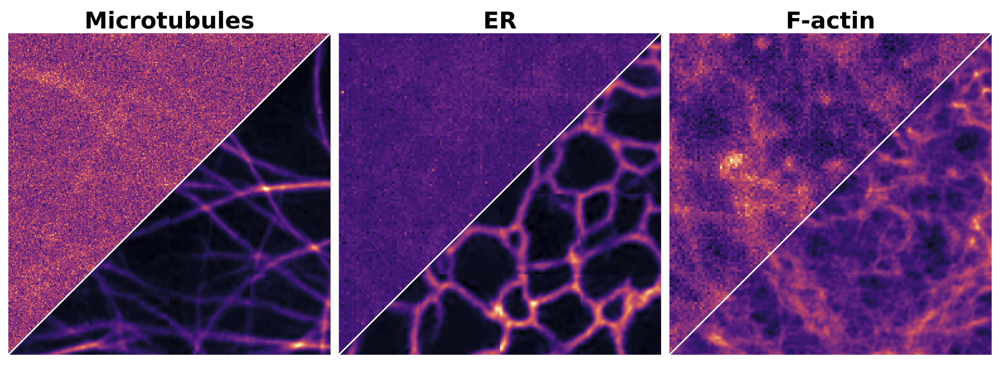

# ResMatching

Official implementation of **ResMatching**, accepted at [ISBI 2026](https://biomedicalimaging.org/2026/).

> **ResMatching: Noise-Resilient Computational Super-Resolution via Guided Conditional Flow Matching**  
> Anirban Ray, Vera Galinova, Florian Jug
> [[arXiv]](https://arxiv.org/abs/2510.26601) | [[Interactive Results]](https://rayanirban.github.io/resmatching/)
> 


## Abstract

> Computational Super-Resolution (CSR) in fluorescence microscopy has, despite being an ill-posed problem, a long history. At its very core, CSR is about finding a prior that can be used to extrapolate frequencies in a micrograph that have never been imaged by the image-generating microscope. It stands to reason that, with the advent of better data-driven machine learning techniques, stronger prior can be learned and hence CSR can lead to better results. Here, we present **ResMatching**, a novel CSR method that uses guided conditional flow matching to learn such improved data-priors. We evaluate ResMatching on 4 diverse biological structures from the BioSR dataset and compare its results against 7 baselines. ResMatching consistently achieves competitive results, demonstrating in all cases the best trade-off between data fidelity and perceptual realism. We observe that CSR using ResMatching is particularly effective in cases where a strong prior is hard to learn, e.g. when the given low-resolution images contain a lot of noise. Additionally, we show that ResMatching can be used to sample from an implicitly learned posterior distribution and that this distribution is calibrated for all tested use-cases, enabling our method to deliver a pixel-wise data-uncertainty term that can guide future users to reject uncertain predictions.

## Installation

```bash
pip install uv
uv sync
```

## Datasets

Experiments use the [BioSR](https://figshare.com/articles/dataset/BioSR/13264793/9) dataset. The following subsets are supported:

| Subset | Structure |
|--------|-----------|
| `ccp` | Clathrin-Coated Pits |
| `er` | Endoplasmic Reticulum |
| `factin` | F-actin |
| `mt` | Microtubules |
| `mt_noisy` | Microtubules data with additional noise added |

## Reproducing Results

There are two workflows depending on whether you want to train from scratch or use pre-trained checkpoints.

> Metrics are reproducible from provided checkpoints. Full retraining may produce slight variance due to non-deterministic operations.

---

### Option A — Train from scratch

**Step 1. Download data**

```bash
# Download all subsets
uv run python scripts/download_data.py

# Or download a specific subset
uv run python scripts/download_data.py --subset ccp
```

Data is saved to `data/<subset>/` by default.

**Step 2. Train**

```bash
uv run python scripts/train.py ccp
```

The best checkpoint is saved to `checkpoints/ccp/best_model.pth`. Training runs for 200 epochs by default.

**Step 3. Run inference**

```bash
uv run python scripts/infer.py ccp --checkpoint checkpoints/ccp/best_model.pth
```

Writes multi-sample TIFFs to `data/ccp/test_results/` and `data/ccp/val_results/`.

**Step 4. Compute metrics**

```bash
uv run python scripts/metrics.py ccp
```

Reads from `data/ccp/test_results/` and prints PSNR, MicroMS3IM, LPIPS, FID, FSIM, and GMSD.

**Step 5. (Optional) Calibration**

```bash
uv run python scripts/calibrate.py ccp --results-dir data/ccp
```

Reads `val_results/` and `test_results/` under `data/ccp/` and saves a calibration curve to `data/ccp/calibration.pdf`.

---

### Option B — Use pre-trained checkpoints

**Step 1. Download data**

```bash
uv run python scripts/download_data.py --subset ccp
```

**Step 2. Download pre-trained checkpoints**

```bash
# Download all checkpoints
uv run python scripts/download_models.py

# Or download a specific checkpoint
uv run python scripts/download_models.py --subset ccp
```

Checkpoints are saved to `checkpoints/<subset>/best_model.pth` by default.

**Step 3. Run inference**

```bash
uv run python scripts/infer.py ccp --checkpoint checkpoints/ccp/best_model.pth
```

**Step 4. Compute metrics**

```bash
uv run python scripts/metrics.py ccp
```

**Step 5. (Optional) Calibration**

```bash
uv run python scripts/calibrate.py ccp --results-dir data/ccp
```

---

## Citation

If you find this work useful in your research, please consider citing:

```bibtex
@article{resmatching2025,
  title={ResMatching: Noise-Resilient Computational Super-Resolution via Guided Conditional Flow Matching},
  author={Anirban Ray and Vera Galinova and Florian Jug},
  journal={arXiv preprint arXiv:2510.26601},
  year={2025}
}
```

## License

MIT
